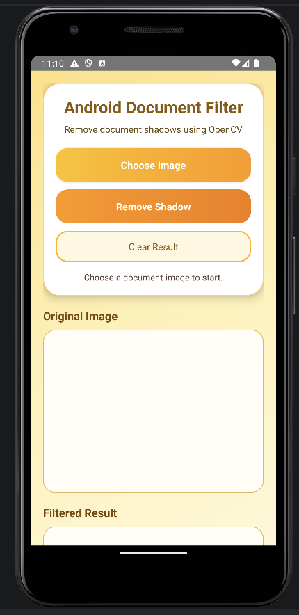
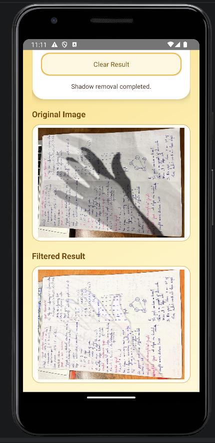

# Lab 6 - Android Document Filter

**Course:** Mobile Development - Lab 6  
**Student:** Nguyễn Lê Như Ngọc  
**Student ID:** 23521031  

## Introduction

Android Document Filter is an Android application that uses OpenCV to reduce shadows from document images. The app allows users to choose a photo from the device, preview the original image, apply a shadow removal filter, and view the processed result directly in the app.

The application is designed with a warm yellow-orange theme, rounded buttons, and a clean layout to make the document filtering process simple and easy to use.

## Main Features

- Choose a document image from the device gallery or file picker.
- Display the original selected image.
- Apply shadow removal using OpenCV image processing.
- Show the filtered result directly below the original image.
- Provide clear status messages during the filtering process.
- Simple and user-friendly yellow-orange interface.
- Rounded buttons and card-style layout for a cleaner mobile UI.
- Supports document photos, handwritten notes, book pages, and paper images with shadows.

## Tech Stack

| Technology | Purpose |
|---|---|
| Kotlin | Main Activity and app interaction logic |
| Java | OpenCV shadow removal filter processing |
| Android SDK | Android application development |
| OpenCV | Image processing and shadow removal |
| XML Layout | User interface design |
| Gradle | Build and dependency management |
| Android Emulator | App testing and demo recording |

## App Interface

The app interface includes three main sections:

1. **Control Panel**  
   Contains the app title, description, Choose Image button, Remove Shadow button, Clear Result button, and status text.

2. **Original Image Section**  
   Displays the selected image before applying the filter.

3. **Filtered Result Section**  
   Displays the output image after the shadow removal filter is applied.

## Demo Screenshots

| Home Screen | Shadow Removal Result |
|---|---|
|  |  |

## How to Use the App

1. Open the Android Document Filter app.
2. Tap **Choose Image**.
3. Select a document, book page, or handwritten note image from the device.
4. The selected image will appear in the **Original Image** section.
5. Tap **Remove Shadow**.
6. Wait for the OpenCV filter to process the image.
7. The processed image will appear in the **Filtered Result** section.
8. Tap **Clear Result** if you want to remove the filtered output and try again.

## Video Demo

Watch the video demo here:

https://drive.google.com/drive/folders/1b0nbQx8vMyMO6vWEbZBn07rvioX_SioV
